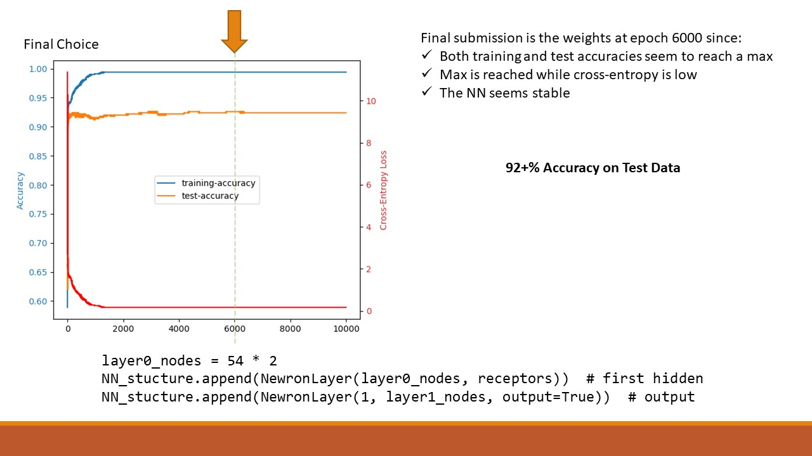

# This is my Neural Network developed from scratch in Python  
Parts are inspired or based on literature / blogs / sites references in the code

## The Task
To classify email as Spam or Not-Spam.  
The data does not reveal words, it just reveals the presence of a word or word derivative.  
We do not know which word corresponds to spam or not.  

## Choice of network
The code is flexible (any number of nodes, layers, and supports Sigmoid, ReLU, and Softmax).  

The final choice of Neural Network was one such that:
```
layer0_nodes = 54 * 2
NN_stucture.append(NewronLayer(layer0_nodes, receptors))    # first hidden
NN_stucture.append(NewronLayer(1, layer1_nodes, output=True))   # output
```

It achieved 92% accuracy with decay learning and stopped at around epoch 6000.

### Video Explanation:
[](https://youtu.be/H5RP_Orvp-k "Neural Network Presentation")

Note: I do not know why literature do not call the first layer the receptor of the hidden layer (or call the first hidden layer the first layer).
What literature calls the input layer is just receptors to the first hidden layer or the output layer if a single layer.  

